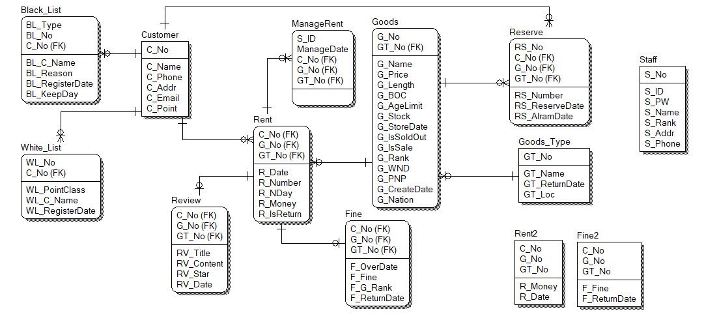

## Library
: 데이터베이스 프로그래밍 기말 과제로 만든 프로젝트   
책과 비디오를 대여할 수 있는 대여점 데이터베이스

</img>

## DB Schema
</img>

* Customer 고객 : 회원 번호, 이름, 휴대 전화, 주소, 이메일, 포인트
* Goods_Type 용품 종류 : 종류번호, 종류 이름, 반납일, 위치
* Goods 용품 : 종류번호, 용품 번호, 용품 이름, 용품 가격, 용품 길이, 용품 컬러/흑백, 용품 나이 제한, 용품 재고, 용품 입고일, 품절 여부, 세일 여부, 용품 등급, 용품 작가/감독, 용품 출판사/제작사, 출판/개봉날짜, 출시 국가
* Rent 대여 : 회원 번호, 용품 종류, 용품 번호, 대여 날짜, 대여 개수, 대여 일수, 대여 금액, 반납 여부
* Fine 벌금 : 회원 번호, 물품 종류, 물품 번호, 경과 일수, 벌금, 물품 등급, 반납 일자
* Reserve 예약 : 회원 번호, 용품 종류, 용품 번호, 예약 번호, 개수, 예약 신청 날짜, 알림 날짜
* Review 후기 : 회원 번호, 용품 종류, 용품 번호, 후기 제목, 후기 내용, 별점, 후기 작성 날짜
* Black_List 블랙 리스트 : 분류, 블랙 리스트 번호, 회원 번호, 이름, 블랙 리스트 사유, 블랙리스트 등록일, 블랙 리스트 유지일
* White_List 우수 고객 : 우수 고객 번호, 회원 번호, 이름, 포인트 등급, 우수 고객 등록일
* Staff 직원 : 직원 번호, 직원 아이디, 직원 비밀번호, 이름, 직원 직급, 주소, 휴대 전화
* ManageRent 대여 관리자 : 직원 아이디, 대여일, 고객 번호, 물품 번호, 물품 종류
* Rent2 섀도우 대여 : 회원 번호, 용품 종류, 용품 번호, 대여 금액, 대여 날짜
* Fine2 섀도우 벌금 : 회원 번호, 물품 종류, 물품 번호, 벌금, 반납 일자
